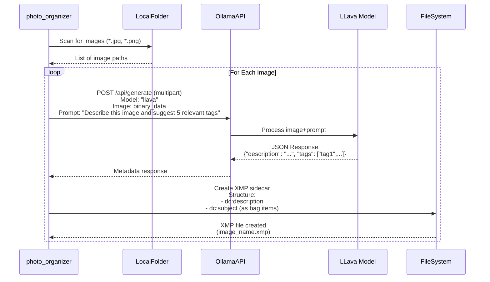

# Photo Organizer

A Go script to automatically generate metadata for images using the LLaVA AI model (via Ollama) and write it to XMP files. This tool aims to streamline image cataloging and organization.


**Note:** The image search functionality is currently **not implemented**.

## Features

* **Metadata Generation:** Automatically generates descriptions and relevant tags for images within a specified folder using the local LLava AI model served by Ollama.
* **XMP Writing:** Writes the generated metadata (description and tags) to corresponding `.xmp` files for efficient integration with various image management software.
* **Local LLava Usage:** Leverages the power of the LLaVA model running locally through Ollama, ensuring data privacy and reducing reliance on external APIs.

## Usage

The `photo_organizer` script is a command-line tool with the following modes and options:

```bash
photo_organizer --mode <generate|search> --folder <path> [options]
```

### Modes

* `generate`: Generates `.xmp` metadata files for each image found in the specified folder.

    ```
    photo_organizer --mode generate --folder <path>
        Generate .xmp metadata files for each image in the folder.
    ```

* `search`: **(Not Implemented)** Intended to search for images based on a text query within the existing metadata. This functionality is not yet available.

    ```
    photo_organizer --mode search --folder <path> --query <text>
        Search for images matching the query in the metadata.
    ```

## Links

- [Ollama](https://ollama.com/), Get up and running with large IA language models on your local.
- [llava](https://llava-vl.github.io/) is a novel end-to-end trained large multimodal model that combines a vision encoder and Vicuna for general-purpose visual and language understanding.
- [llava on Ollama](https://ollama.com/library/llava), LLaVA on Ollama library.
  
